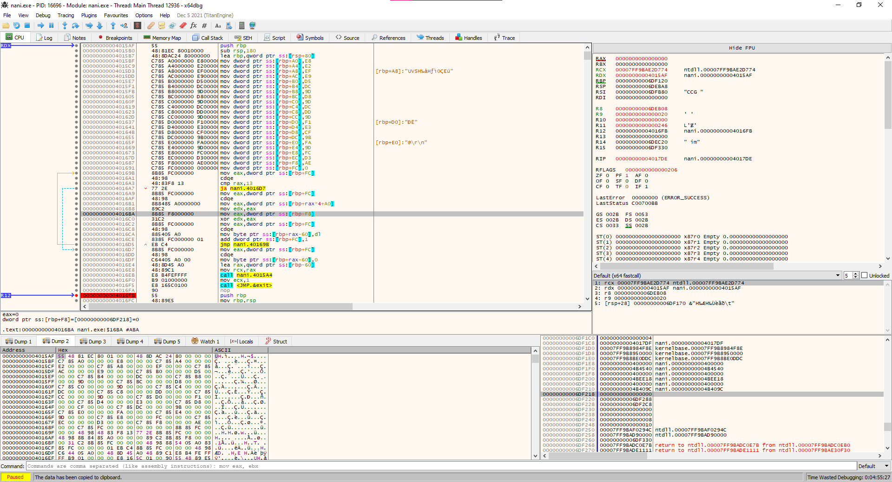

# 0x03 Reverse

## Homework - Fifo

這題內容其實還滿清楚的，雖然簡單，但是該有的概念都有，Decoded File (T1140), NX Bit, 各種 Linux 的 syscall，解一解有種越解越好完的感覺。

Main Function 一開始有一大堆的寫死的資料，透過某個 Function 去轉換:


簡單看了一下這邊的結構以及 `0x12E9` 的函式，感覺上來說這是一個 Decode Function，而 Key 存放的位置在 `0x2020`。這時候有幾種選擇，第一是去 Reverse `0x12E9` 的 decode function，第二種是直接把程式 run 起來，透過 GDB 的 Breakpoint 觀察 stack 中的值直接取的 decoded data。我是選用第二種方法，得到的結果如下：

- `rbp-0x70` Path: `/tmp/bnpkevsekfpk3`
- `rbp-0x30` Full Path: `/tmp/bnpkevsekfpk3/aw3movsdirnqw` (FIFO Name)
- `rbp-0x50` File: `/tmp/khodsmeogemgoe` (ELF Writing Point)
- `.data: 0x4040`: A Big Data Chunk, Looks like a ELF File Format (by using `x/s`)


接著 reverse `Main` 剩餘的部分，可以發現程式接下來的邏輯如下:

- 把剛剛那一大塊 ELF 的資料寫入 `/tmp/khodsmeogemgoe` 這個檔案
- Fork 出一個 child 去執行上面那隻 ELF
- 檢查並新增 `/tmp/bnpkevsekfpk3/aw3movsdirnqw` 這個 FIFO 檔 (`mkfifo`)
- open fifo pipe, 並寫入 `0xD8` 長度的 decode_key
- 關掉檔案，結束

看完了 Fifo，下一個 Reverse 的對象就是剛剛寫出的 ELF 檔 `/tmp/khodsmeogemgoe`。這支的行為有以下幾個:

- 讀取 Fifo 中的資料
- 重新用同樣的 Decode function 去 decode 出我們最終的 Flag。

Reverse 到這邊才發現，原來 `0x2020` 後面還藏有一段 instructions，在看到 `mov rax, [rbp+var_108]; call rax;` 後檢查一下這支 Binary NX-bit 是沒開的，所以理論上還需要繼續 Reverse 下一段程式碼 (最後還是有 Reverse 了一下，是一段用到 socket 的程式碼)，但我用 gdb 跑所以就看到 flag 了，算是意外得到 flag 了 XD


## Homework - giveUFlag

### Flag 取得

如果以純解題來看的話，在走 Main 流程的時候走到 `sub_4015F3` 就可以發現，整隻程式的運作原理，就是一直 Sleep 如果等得夠久的話 Flag 就會自己出現了 XD

當然我們可以直接理解 Decode 的地方，流程如下:

- 取得 `YOU_USE_HAIYA_WHEn_YOU'RE_DISAPPOINTED_MMSSGG` 字串
- 和 `0x403040` 的 key 做 xor

寫成 Script 後如下:

```python
# 透過 r2 把資料取出來
import struct
buf = struct.pack ("180B", *[
0x1f,0x00,0x00,0x00,0x03,0x00,0x00,0x00,0x14,0x00,0x00,
0x00,0x18,0x00,0x00,0x00,0x2e,0x00,0x00,0x00,0x03,0x00,
0x00,0x00,0x24,0x00,0x00,0x00,0x0d,0x00,0x00,0x00,0x3b,
0x00,0x00,0x00,0x70,0x00,0x00,0x00,0x07,0x00,0x00,0x00,
0x6f,0x00,0x00,0x00,0x1e,0x00,0x00,0x00,0x0f,0x00,0x00,
0x00,0x12,0x00,0x00,0x00,0x17,0x00,0x00,0x00,0x24,0x00,
0x00,0x00,0x20,0x00,0x00,0x00,0x3b,0x00,0x00,0x00,0x06,
0x00,0x00,0x00,0x0b,0x00,0x00,0x00,0x64,0x00,0x00,0x00,
0x16,0x00,0x00,0x00,0x0d,0x00,0x00,0x00,0x74,0x00,0x00,
0x00,0x0c,0x00,0x00,0x00,0x1b,0x00,0x00,0x00,0x7c,0x00,
0x00,0x00,0x63,0x00,0x00,0x00,0x1e,0x00,0x00,0x00,0x13,
0x00,0x00,0x00,0x60,0x00,0x00,0x00,0x7f,0x00,0x00,0x00,
0x78,0x00,0x00,0x00,0x7f,0x00,0x00,0x00,0x65,0x00,0x00,
0x00,0x64,0x00,0x00,0x00,0x65,0x00,0x00,0x00,0x7e,0x00,
0x00,0x00,0x6c,0x00,0x00,0x00,0x6c,0x00,0x00,0x00,0x62,
0x00,0x00,0x00,0x62,0x00,0x00,0x00,0x76,0x00,0x00,0x00,
0x3a,0x00,0x00,0x00])

msg = "YOU_USE_HAIYA_WHEn_YOU'RE_DISAPPOINTED_MMSSGG"

result = ""

for i in range(45):
    result += chr(ord(msg[i]) ^ buf[i*4])

print(result)
```

Flag: `FLAG{PaRs1N6_PE_aNd_D11_1S_50_C00111!!!!!111}`

### 其他紀錄

TLSCallback

- https://docs.microsoft.com/en-us/cpp/parallel/thread-local-storage-tls?view=msvc-170
- http://lallouslab.net/2017/05/30/using-cc-tls-callbacks-in-visual-studio-with-your-32-or-64bits-programs/

TLS Option Section 有寫

`start - 0x401180`

- It has sleep mechanism for 0x3E8 millieseconds
- _initterm
  - There are two _initterm to Two functions: `sub_401130`, `sub_401010`

`sub_401010`

- gui app ? console app ?

`sub_0x401940`

- Being call twice, first b4 main, second in main

sleep a lot and give u img and give u flag

`YOU_USE_HAIYA_WHEn_YOU'RE_DISAPPOINTED_MMSSGG`

怎麼感覺真的是在 give u Flag....

## Homework - Nani

這題的 code base 比較大一點，有看到許多有意思程式碼，也有許多程式碼還並沒有看懂就先找到 Flag 了，所以這邊只先以繞過 anti-debugger 和 anti-vm，以及找到 Flag 的過程去描述。

### Bypass Anti-Debugger & Anti-VM

這支 binary 有用到幾個 Anti-Reverse 的做法:

- UPX 3.96 Packer
- 執行 `IsDebuggerPresent` 確認目前是否在 Debugger 中
- 從 `cpuid`, `rax = 40000000h` 取得 cpu 資訊，比對是否在 KVM, HyperV, Vmware, Virtualbox, XenVm 中

Packer 的部分簡單，透過 Detect it Easy 可以判斷出相應的 UPX version 來脫殼。`IsDebuggerPresent` 可以透過 x64dbg 的 ScyllaHide Plugin 處理。VM 的部分，雖然說我並沒有在 VM 中執行，但是在需要開啟 Docker 的狀況下系統 hyper v 是有打開的，所以這邊有簡單的透過 patching 把比對字串改掉，簡單 bypass 掉 anti-vm 的功能。

### Finding Flag

在 Anti-VM 結束後，整隻程式執行到 `0x17DF` 後，發現這邊有一隻帶有 `VirtualProtect` 的 Exception Handler。詳細 reverse 後發現這裡有寫一段與 `0x87` xor 的資料到 `0xAF15` 這個位在 `.text` section 的記憶體位置，寫完之後再把 `.text` 的權限調回 r-x。這裡就很有趣拉，實際看一下 `0xAF15` 位置上的資料，發現 0x100 byte 之後的資料看起來也是一段程式碼，所以最後直接下 x64dbg 斷點到 handler 裡面，直接從 debugger 截出最後生出 flag 的程式碼。



因為我不確定怎樣會觸發到這段程式碼，最後乾脆直接 reverse 這段程式碼後，寫出一個 script 得到最後的 Flag:

```python
encoded_str = [ 0xE8, 0xE2, 0xEF, 0xE9, 0xD5, 0xDC, 0x9D, 0xD8, 0x9D, 0xDC, 0xDD, 0x9D, 0xF1, 0xE3, 0xCF, 0x9B, 0xFA, 0x9D, 0xFC, 0xD3 ]
key = 0xAE

result = ""

for i in range(0x13+1):
    result += chr(encoded_str[i] ^ key)

print(result)
```

Flag: `FLAG{r3v3rs3_Ma5T3R}`
